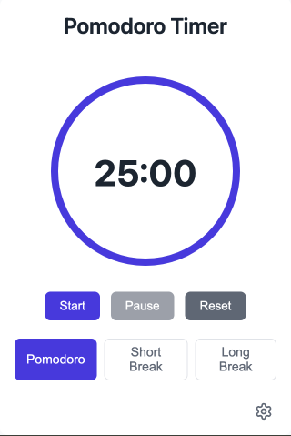

# Focus Tomato 🍅

生産性を向上させるための、モダンでクリーンなポモドーロタイマー Chrome 拡張機能です。



## 機能

- 🎯 円形のプログレスインジケーターを備えた、クリーンでモダンな UI
- ⏱️ 3 つのタイマーモード：
  - ポモドーロ（デフォルト：25 分）
  - 短い休憩（デフォルト：5 分）
  - 長い休憩（デフォルト：15 分）
- ⚙️ タイマー持続時間のカスタマイズ
- 🔄 休憩とポモドーロの自動開始
- 🔔 通知音
- 📱 タイマー完了時の Chrome 通知

## インストール

### Chrome Web Store から（近日公開予定）

1. Chrome Web Store にアクセスします。
2. 「Focus Tomato」を検索します。
3. 「Chrome に追加」をクリックします。

### 手動インストール（開発者モード）

1. このリポジトリをクローンします。

   ```bash
   git clone https://github.com/yt-hsgw/focus-tomato.git
   ```

2. 依存関係をインストールします。

   ```bash
   npm install
   ```

3. 拡張機能をビルドします。

   ```bash
   npm run build:extension
   ```

4. Chrome を開き、`chrome://extensions/`に移動します。
5. 右上の隅にある「開発者モード」を有効にします。
6. 「パッケージされていない拡張機能を読み込む」をクリックし、`dist`ディレクトリを選択します。
7. 拡張機能がインストールされ、ツールバーに表示されます。

## 開発

1. リポジトリをクローンします。
2. 依存関係をインストールします。

   ```bash
   npm install
   ```

3. 開発サーバーを起動します。

   ```bash
   npm run dev
   ```

4. Chrome 拡張機能としてテストするには、拡張機能をビルドします。

   ```bash
   npm run build:extension
   ```

## 使い方

1. Chrome ツールバーの拡張機能アイコンをクリックしてタイマーを開きます。
2. ポモドーロ、短い休憩、長い休憩から目的のタイマーモードを選択します。
3. 「開始」をクリックしてタイマーを開始します。
4. 「一時停止」でタイマーを一時的に停止し、「リセット」で最初からやり直します。
5. 設定アイコンをクリックして設定にアクセスし、体験をカスタマイズします。

## カスタマイズ

設定アイコンをクリックしてカスタマイズできます。

- ポモドーロ時間（1〜60 分）
- 短い休憩時間（1〜30 分）
- 長い休憩時間（1〜60 分）
- ポモドーロ完了後の休憩の自動開始
- 休憩完了後のポモドーロの自動開始
- 通知音の設定

## ライセンス

このプロジェクトは MIT ライセンスの下でライセンスされています - 詳細は LICENSE ファイルを参照してください。
